# Mathematical Foundations of Low Default Portfolio PD Estimation

**Author:** Vincent Haïk Karakoseian  
**Project:** DDEFI — EY Quantitative Advisory Services (QAS), Financial Services  
**Original report date:** May 2026

> This document is a **full Markdown transcription and English translation of the mathematical material contained in the original LaTeX report**. The structure, examples, derivations, interpretations, advantages, limitations, and modeling arguments have been retained point by point.  
> Presentation-specific LaTeX commands (page breaks, margins, logos, headers, spacing commands, etc.) are intentionally omitted because they have no mathematical content. Standard English notation is used where appropriate (for example, `Var` for variance), while the substantive reasoning of the source is preserved.

---

# Project presentation

This third-year project was carried out in collaboration with **EY**, within the **Quantitative Advisory Services (QAS)** team of the **Financial Services (FSO)** department. The work focuses on **credit-risk modeling**, and more specifically on estimating the **Probability of Default (PD)** for portfolios known as **Low Default Portfolios (LDPs)**.

PD modeling is a central issue for financial institutions because it directly enters the calculation of expected losses, regulatory capital, and the overall management of credit risk. However, some portfolios — generally composed of very high-quality assets such as banks, sovereigns, and large international corporations — exhibit extremely low historical default rates. These portfolios are referred to as **LDPs**.

The distinctive feature of LDPs is that standard statistical methods relying on large-sample behavior become difficult to apply. Because the number of observed defaults is very small, empirical estimators may become unstable, biased, or insufficiently conservative from a regulatory perspective. Alternative approaches are therefore required, including prudent upper-bound methods, Bayesian-type techniques, and more advanced statistical-inference procedures.

The main objective of this project is therefore to **identify, study, and compare several methods specifically designed for PD modeling in Low Default Portfolios**. The analysis considers:

- the quantitative behavior of the models;
- the relevance of their assumptions;
- their advantages and limitations;
- and their usefulness in an operational banking context.

---

# I. The Pluto–Tasche model

## I.1. Clarifications on the model

The **Pluto–Tasche method (2006)** is an approach designed to estimate **Probability of Default** when the number of observed defaults is **extremely small**, typically 0, 1, or 2 defaults over several years.

It is therefore particularly suited to **Low Default Portfolios**.

The problem can be illustrated by a portfolio containing:

- **10,000 exposures**;
- but only **0 or 1 observed default over 10 years**.

### What is an exposure?

An **exposure** is the elementary unit on which the probability of default is measured. It is an individual borrower or credit contract against which the bank is exposed to a possible loss.

In other words, it is one individual element of the portfolio on which a default event may occur.

Examples include:

- **An individual loan**  
  Example: a EUR 1 million loan granted to Company X  
  $\rightarrow$ counts as one exposure.

- **A credit line / overdraft facility**  
  Example: a EUR 10 million authorized credit line to Company Y  
  $\rightarrow$ counts as one exposure.

- **A bond or debt security held by the bank**  
  Example: an Italian government bond  
  $\rightarrow$ counts as one exposure.

- **A derivative counterparty**  
  Example: a swap entered into with a corporate counterparty  
  $\rightarrow$ counts as one exposure.

If the PD is estimated empirically, one obtains:

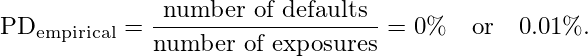

The report argues that values of this magnitude may be considered insufficiently prudent for regulatory purposes such as Basel III.

---

## I.2. Mathematical aspects of the Pluto–Tasche model

Pluto–Tasche provides a statistical method for obtaining a **minimum prudent and justifiable PD**.

The principle used in the project is:

> Construct a confidence-type upper bound for an extremely small proportion and use the upper bound as the prudent PD estimate.

For instance, the PD can be associated with an upper bound at a 95% confidence level.

A default indicator is modeled as:

- 0: no default;
- 1: default.

Let $X_i$ denote the default indicator of exposure $i$:

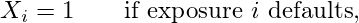

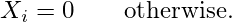

Each exposure is modeled as

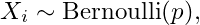

where $p$ is the unknown PD.

If there are $N$ exposures, the total number of defaults is

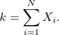

Therefore:

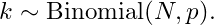

The corresponding probability mass function is

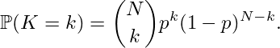

This model describes the theoretical behavior of the number of defaults.

### Distribution used for the unknown PD

The report then considers a plausible distribution for $p$ after observing $k$ defaults among $N$ exposures:

Its density is written as:

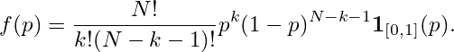

Because $p$ is itself a probability, its density is naturally defined only over $[0,1]$.

For two bounds $a$ and $b$,

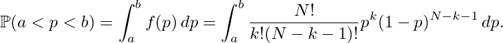

### Why not use the mean?

A first idea would be to use the mean of the distribution of $p$:

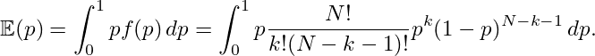

However, the report argues that this estimate is not sufficiently prudent because it may underestimate PD.

A more conservative choice is therefore to specify a confidence level, for example 90% or 95%, and to search numerically for a value $p^\star$ such that

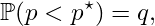

where $q$ denotes the chosen confidence level.

The value $p^\star$ is the **quantile at level $q$**.

Equivalently, $p^\star$ solves

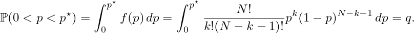

Interpretation:

- $q\%$ of the plausible PD values lie below $p^\star$;
- $(100-q)\%$ lie above $p^\star$.

For example, with $q=95\%$, the chosen PD belongs to the upper 5% of plausible PD values. It is therefore conservative while remaining compatible with the observed data.

---

### Case 1: $k=0$

When no default is observed,

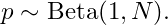

The density becomes

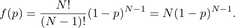

Hence

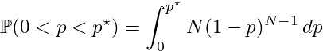

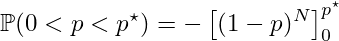

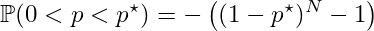

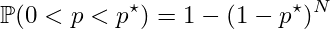

Imposing the confidence level gives

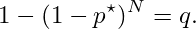

Therefore:

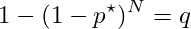

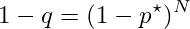

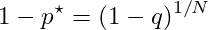

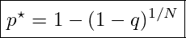

So the closed-form estimator is

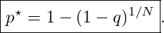

For $q=95\%$ and $N=3000$:

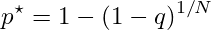

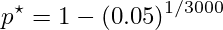

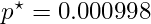

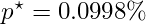

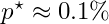

The resulting PD is therefore approximately **0.1%**. It is very low, which is consistent with the fact that no default was observed, but it remains strictly positive.

This is the simplest case.

---

### Case 2: $k=1$

With one observed default,

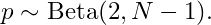

The density is

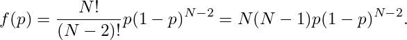

The cumulative probability is

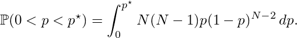

The report performs the integration as follows:

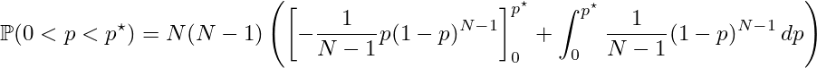

Then:

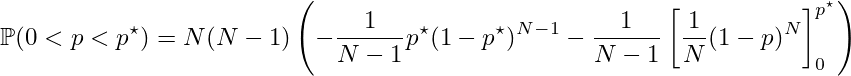

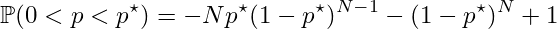

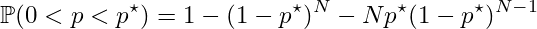

Therefore $p^\star$ is obtained by solving

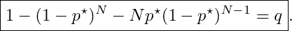

Unlike the $k=0$ case, the solution is obtained numerically.

For $q=95\%$ and $N=3000$, the report obtains by numerical bisection:

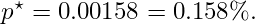

This PD is slightly higher than in the zero-default case, which is consistent with $k=1\gt0$.

---

## I.3. Advantages and disadvantages of Pluto–Tasche

### Advantages

According to the report, Pluto–Tasche is attractive for LDP PD modeling because:

- it is **prudent**, since it produces a PD greater than zero even when no historical default has been observed;
- it works even when $k$ is extremely small, such as $0$ or $1$;
- it is **simple and explainable**, rather than a black-box approach;
- it is described as **robust to small data variations**, in the sense that a small change in $N$ does not cause the PD estimate to explode;
- it does **not require heavy calibration**; a simple Python script or even a calculator can be sufficient.

### Disadvantages

The report also identifies several limitations:

- its conservative nature may lead to an **overestimation of PD**, which can penalize a bank in terms of regulatory capital;
- the choice of the confidence level can be **arbitrary**;
- it is a **univariate method**, using only $k$ and $N$ and ignoring additional information such as borrower financial characteristics, macroeconomic variables, or market volatility;
- it relies on strong assumptions of **independence and homogeneity of exposures**: each exposure is assumed to have the same PD and defaults are assumed independent, whereas real portfolios can contain heterogeneous exposures, non-negligible default correlation, and geographic or sectoral clusters.

---

# II. Possible extensions

## II.1. Changing the prior distribution of $p$

In a Bayesian framework, the Probability of Default $p$ is treated as a random variable rather than as a fixed number. It therefore has a distribution before the current data are observed.

This pre-data distribution is the **prior distribution** of $p$.

Concretely, it represents the initial knowledge or belief about the PD before observing defaults in the dataset.

The Pluto–Tasche formulation used above gives, after observing $N$ exposures and $k$ defaults:

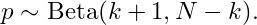

This is interpreted in the report as a posterior distribution for $p$.

More generally, in a Beta–Binomial Bayesian framework:

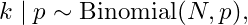

and if the prior distribution is

then the posterior distribution is

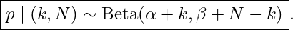

The report compares:

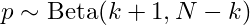

with

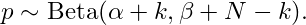

From this comparison, it identifies the formal parameter correspondence

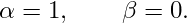

That would correspond to a $\mathrm{Beta}(1,0)$ prior, which is not a proper Beta distribution because valid Beta parameters must satisfy

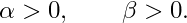

The report therefore states that, as a first approximation and because $N$ is often very large, the Pluto–Tasche setup can be approximated by a Bayesian framework with a **uniform $\mathrm{Beta}(1,1)$ prior**.

Thus:

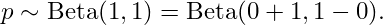

The corresponding density is

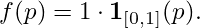

The report interprets this as saying that, before observing the data, every PD value between 0 and 100% is considered possible, so no informative prior knowledge is introduced.

### Non-uniform priors

An extension consists in choosing a non-uniform prior

The report uses the usual pseudo-count interpretation:

- $\alpha-1$ is interpreted as a number of **fictitious defaults** before observing the current data;
- $\beta-1$ is interpreted as a number of **fictitious non-defaults**.

Therefore:

- with $\mathrm{Beta}(1,1)$, the prior contains 0 fictitious defaults and 0 fictitious non-defaults;
- with $\mathrm{Beta}(1,1000)$, the prior contains 0 fictitious defaults and 999 fictitious non-defaults, corresponding to a belief in a very low PD;
- with $\mathrm{Beta}(1000,1)$, the prior contains 999 fictitious defaults and 0 fictitious non-defaults, corresponding to a belief in a very high PD.

The interpretation can also be seen through the Beta mean.

If

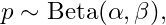

then

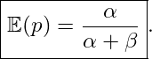

Therefore:

- if $\alpha$ is small and $\beta$ is large,

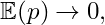

so a low PD is expected;

- if $\alpha$ is large and $\beta$ is small,

so a high PD is expected;

- if $\alpha=\beta=1$,

### Important modeling note retained from the report

The original report explicitly emphasizes that the **Pluto–Tasche method itself is not presented as a Bayesian method**. For the purpose of the extension developed in the project, the report chooses to approximate it with a Bayesian $\mathrm{Beta}(1,1)$ prior framework.

Within that generalized Bayesian framework, one can choose

according to prior information about the portfolio.

After observing $N$ exposures and $k$ defaults, the posterior becomes

A high posterior quantile $p^\star$ is then selected, as before.

The posterior density used in the report is written as

The prudent quantile is determined by

The report considers levels such as $q=95\%$ or $q=90\%$.

Examples of possible prior beliefs mentioned in the report include:

- bonds issued by large international corporations or large banks may have a PD around **0.05%**;
- AAA-rated government bonds may have a PD around **0.01%**;
- regional banks may have a historical PD around **0.1%**.

Such prior information may come from:

- macroeconomic views;
- Moody's ratings or studies;
- other models;
- or, more generally, any source containing relevant information about PD before observing the current dataset.

This provides a first generalization of the base Pluto–Tasche framework.

In a classical Bayesian framework, $\alpha$ and $\beta$ are fixed before observing the current data. The report then considers an alternative **Empirical Bayes** approach in which $\alpha$ and $\beta$ can instead be estimated from data.

---

## II.2. A more general hierarchical approach

Before calculating PD, it can be useful to segment the portfolio by, for example:

- **sector**: industry, services, finance, etc.;
- **rating**: AAA, AA+, AA−, BBB, etc., for sovereign or corporate bonds;
- **company size**, for corporate-bond portfolios.

Each segment $j$ then has:

- its own number of exposures $N_j$;
- its own number of defaults $k_j$;
- its own PD $p_j$.

The key idea is that the segment PDs are not treated as unrelated quantities. They share a common portfolio-level prior parameterized by $\alpha$ and $\beta$:

The report refers to this common higher-level distribution as an **hyper-prior**.

For each segment, after observing $(k_j,N_j)$:

The report writes the corresponding density in the form

As before, high quantiles are then used to obtain segment-level prudent PD estimates.

### Information sharing and shrinkage

A central observation is that **data-poor segments benefit from information contained in data-rich segments**.

A common mistake would be to let $\alpha$ and $\beta$ depend independently on $j$. The report argues that this would remove the key advantage of the hierarchical approach.

Instead, a **common prior distribution** is shared by all segments and reflects the overall level of portfolio risk.

The PD of each segment is therefore a compromise between:

- information specific to that segment;
- and information from the overall portfolio.

This is the **shrinkage** mechanism:

> Small or poorly informed segments are pulled toward the global portfolio mean.

---

### Illustrative example

Consider the following segmentation:

| Segment | Number of exposures | Observed defaults |
|---|---:|---:|
| Industry | 3000 | 0 |
| Services | 2500 | 1 |
| Finance | 200 | 0 |

Using the initial Pluto–Tasche approach at a 95% level, the report obtains:

For **Industry**:

For **Services**:

For **Finance**:

This result is surprising: the Finance segment is estimated to be more than ten times riskier than Industry despite having no additional observed default. The difference is driven mainly by the much smaller segment size.

The report highlights this as a known issue:

> Small segments may generate extreme PD estimates — either very high or very low.

The hierarchical model is introduced specifically to mitigate this effect.

---

### First rough estimate of the hyperparameters

In the illustrative example there is 1 observed default among 5700 exposures.

The report first proposes a rough approximation:

- $\alpha = 1 + \text{number of defaults} = 2$;
- $\beta = 1 + \text{number of non-defaults} = 5700$.

The common prior is therefore approximated as

The segment posterior distributions are then written as:

For **Industry**:

For **Services**:

For **Finance**:

The 95% prudent PD estimates given in the report are:

These values are much closer to each other and are presented as economically more coherent than the independent segment estimates.

---

### Empirical-Bayes calibration

The report stresses that the previous values of $\alpha$ and $\beta$ are only a rough approximation.

In the actual hierarchical model, $\alpha$ and $\beta$ are estimated from data by **maximizing the marginal likelihood**.

In an Empirical-Bayes framework:

- $\alpha$ and $\beta$ are treated as unknown hyperparameters;
- they are estimated from the observed segment data.

The marginal likelihood used in the report is

The Beta function is written as

Therefore, optimization algorithms can search for the values of $\alpha$ and $\beta$ that maximize

This is another level of generalization beyond the base Pluto–Tasche approach.

---

# III. Comparison with the Wilson method

## III.1. Motivation

The starting point is again a portfolio with:

- $N$ exposures;
- $k$ observed defaults.

The empirical PD estimator is

As before:

with

The report uses:

and

For large $N$, the Central Limit Theorem motivates

Equivalently:

Dividing numerator and denominator appropriately by $N$ gives

The usual normal/Wald approximation then replaces the unknown $p$ in the denominator by $\hat p$:

For a standard normal variable $Z$,

Therefore:

Isolating $p$ gives

Hence:

Or:

This is the classical normal interval.

---

### Problems with the classical normal interval

The report identifies several problems.

#### 1. Degeneracy when $k=0$

If $k=0$,

and the normal interval may collapse to a zero PD estimate. The report considers this unsuitable for LDP prudential modeling because a strictly zero PD is not sufficiently conservative.

#### 2. Replacing the true variance term by an estimated one

The report writes the standardized variable as

It recalls that

For the variance:

The associated standard deviation is

The report's discussion is that, for convenience, the unknown $p$ is replaced by the noisy estimator $\hat p$ in this variance term.

Thus the true standard deviation is replaced by an estimated/noisy standard deviation.

When $N$ is small, $\hat p$ can vary strongly from one sample to another.

The report illustrates this idea by noting that different samples may produce values such as:

The point of the example is that $\hat p$ can move sharply when the effective amount of information is low.

---

### Jensen-inequality argument developed in the report

The function

is concave because

For a concave function, Jensen's inequality gives

Taking $X=\hat p$:

The report uses this to motivate a **downward bias in the plug-in variance term** $\hat p(1-\hat p)$ relative to $p(1-p)$.

It further argues that the effect becomes more material when the estimator $\hat p$ itself is highly variable.

The consequence described in the report is an overly narrow interval for $p$.

The desired interval has the form

Equivalently:

The report gives an illustrative comparison.

Instead of an interval such as:

- $\hat p_{\mathrm{upper}}=0.5\%$;
- $\hat p_{\mathrm{lower}}=0.05\%$;

one might obtain an interval such as:

- $\hat p_{\mathrm{upper}}=0.3\%$;
- $\hat p_{\mathrm{lower}}=0.1\%$.

The latter is narrower and therefore less prudent.

The report explains coverage as follows:

> A 95% confidence interval means that if the sampling experiment were repeated many times, approximately 95% of the intervals constructed by the procedure would contain the true PD.

For example, if the true PD were 1% and one repeated the experiment 10,000 times on independent samples, approximately 9,500 intervals should contain $0.01$ and about 500 may miss it.

If the interval is systematically too narrow, there can be more than 5% misses, so the **actual coverage** falls below 95%.

This motivates the use of the **Wilson method**.

---

## III.2. Mathematical derivation of the Wilson method

The derivation starts again from

The goal is to derive an interval by solving directly for $p$ rather than relying on the same plug-in structure as the Wald interval.

The admissible values of $p$ are characterized through the score inequality.

The derivation in the report proceeds to the quadratic inequality:

Squaring both sides:

Multiplying by $N$:

Expanding:

Moving all terms to the left gives

Therefore:

This is a quadratic inequality in $p$.

Define the polynomial

The admissible PD values lie between the two roots.

After algebraic simplification, the Wilson interval can be written in its standard form:

In a prudent setting, the project retains the upper root:

### Behavior when $k=0$

When

we also have

Then the upper Wilson bound becomes

Therefore:

Even with no observed default, Wilson produces a strictly positive prudent bound.

---

## III.3. Advantages and disadvantages of the Wilson method

The Wilson method is presented as an improvement over the classical normal interval for estimating a proportion $p$ from $k$ successes over $N$ Bernoulli trials — here, $k$ defaults among $N$ exposures.

It starts from

and solves the inequality in $p$ rather than substituting $\hat p$ for $p$ inside the variance at the critical step.

The interval is bounded by roots

and for prudential purposes the upper root is retained:

Here $z$ is the standard-normal quantile associated with the selected confidence level.

---

### Advantages

#### 1. Improvement over the classical normal/Wald interval

Unlike the normal interval

the Wilson method is not based on the same direct plug-in interval construction.

The report argues that this reduces the coverage problems associated with unstable $\hat p$ values and provides a generally more reliable confidence interval.

#### 2. Non-degenerate behavior for $k=0$

Even when no default is observed and $\hat p=0$, the upper Wilson bound remains strictly positive:

This is particularly useful in LDP prudential applications, where a zero PD is considered inappropriate.

#### 3. Operational simplicity

The formula is closed-form.

There is no need for a numerical quantile search of the type used in the Beta-quantile approach.

It is therefore:

- fast to implement;
- straightforward to audit;
- and computationally lightweight.

The report presents Wilson as an attractive alternative when a robust and simple frequentist method is desired.

#### 4. Bounds remain within $[0,1]$

The Wilson construction gives bounds that remain coherent as proportions.

This avoids some artifacts of the normal approximation, such as negative lower bounds or upper bounds larger than 1 in extreme cases.

---

### Disadvantages

#### 1. Asymptotic foundation and limitations of the normal approximation in LDPs

Wilson remains based on a normal approximation motivated by the Central Limit Theorem.

Recall:

For large $N$,

Equivalently:

The report stresses that reliability is not merely a matter of "$N$ being large."

A good normal approximation requires a regime in which both

and

Practical rules of thumb are often written as

Indeed, for

we have

and

The Central Limit Theorem gives

but the approximation is meaningful when the variance

becomes sufficiently large.

Therefore one needs, in practice,

These conditions ensure that there are sufficiently many expected defaults and non-defaults for the binomial distribution to become smooth and approximately symmetric.

By contrast, in an LDP, $Np$ may remain very small even when $N$ itself is large.

The report gives the example:

Although $N$ is large, the expected number of defaults is only 1.

The distribution of $k$ is then highly concentrated on small integer values and is close to a Poisson distribution with parameter

which is far from a symmetric bell-shaped distribution.

The report therefore notes that a symmetric normal approximation with support on the whole real line may:

- allocate artificial probability mass to negative values even though $k\ge0$;
- underestimate the right tail when $p$ is very small because of asymmetry;
- produce intervals whose actual probability of containing the true PD is not exactly equal to the nominal confidence level, such as 95%.

---

#### 2. No direct probability distribution for $p$

Wilson produces a **frequentist confidence interval**, not a posterior probability distribution for $p$.

Therefore one should not interpret a 95% confidence interval as:

> "There is a 95% probability that $p$ belongs to this particular interval."

The frequentist interpretation is instead:

> If the sampling experiment were repeated many times and a Wilson interval were reconstructed each time, approximately 95% of those intervals would contain the true value of $p$.

In a prudential setting, where one reasons about a single actual portfolio rather than a hypothetical infinite repetition of experiments, the report considers this interpretation less intuitive than a Bayesian posterior approach such as a Beta-quantile model.

Because Wilson does not assign a probability distribution to $p$ in the Bayesian sense, the report also notes that it does not naturally provide a hierarchical shrinkage mechanism between segments.

---

#### 3. Purely univariate method

Like classical Pluto–Tasche, Wilson depends only on:

- $N$;
- $k$;
- the selected confidence level.

It does not directly incorporate additional information such as:

- counterparty quality;
- macroeconomic variables;
- within-portfolio heterogeneity;
- an explicit segment structure;
- dependence between defaults.

It is therefore simple and robust, but structurally limited.

---

#### 4. No information-pooling mechanism between segments

When Wilson is applied segment by segment, each segment is treated independently.

There is no mechanism analogous to hierarchical shrinkage for sharing information across segments.

Consequently, for small or poorly populated segments, the upper bound may become highly conservative simply because local information is scarce.

The report notes that this is precisely what is observed empirically for the weakest segments in the numerical study.

---

#### 5. Potentially excessive prudence in practice

Even though Wilson improves on the classical normal interval, its upper bound can become highly conservative in rare-default settings, especially when:

- $N$ is moderate;
- $k$ is very small;
- or individual segments are small.

The report highlights this as an empirical finding of the project:

> In the numerical study, the Wilson upper bound is the most conservative estimator among the compared methods.

---

# Summary of the mathematical progression

The mathematical development of the project follows the sequence below.

### 1. Base LDP problem

Empirical PD is unstable when only a few defaults are observed.

### 2. Classical prudent Pluto–Tasche-type estimate

and a high quantile $p^\star$ is retained.

### 3. Generalized Beta prior

leading to

### 4. Hierarchical model

with

Shared hyperparameters produce **shrinkage**.

### 5. Empirical-Bayes calibration

The hyperparameters are estimated from the data.

### 6. Frequentist benchmark: Wilson

Wilson provides a closed-form prudent upper bound but no hierarchical information-sharing mechanism.

---

# Disclaimer

This document reproduces and translates the mathematical development of an academic project carried out in collaboration with EY Quantitative Advisory Services (QAS). The work, derivations, implementation, and interpretations presented here are the author's academic work and should not be interpreted as official EY methodology, research, or advice.
